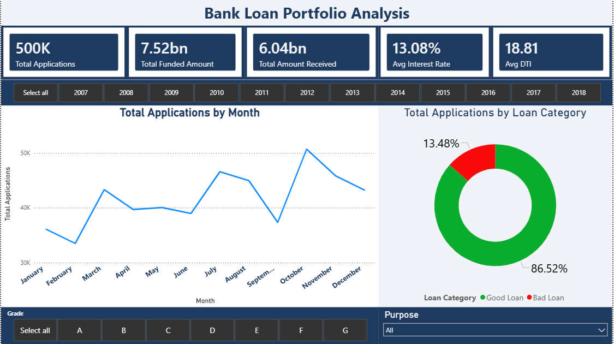
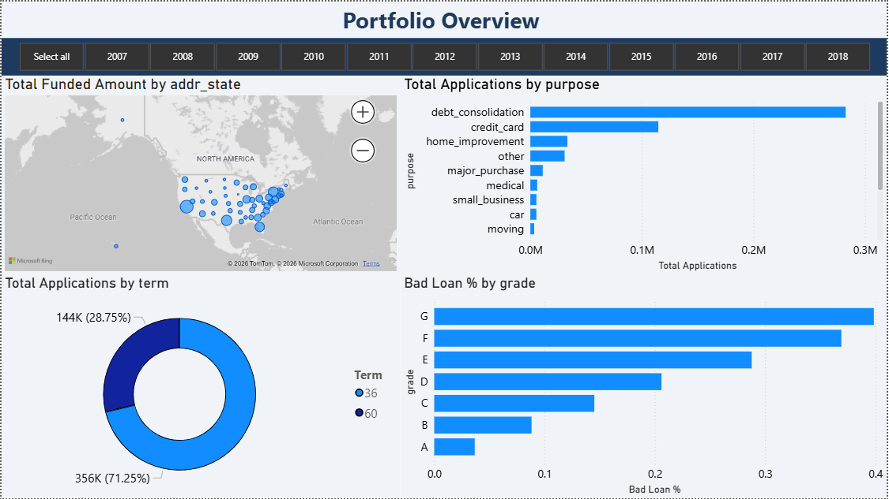
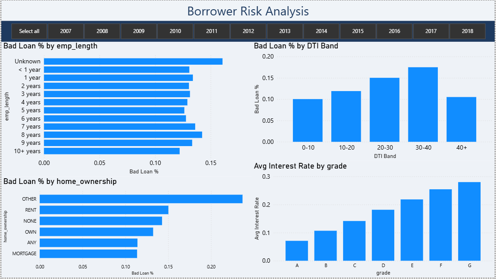
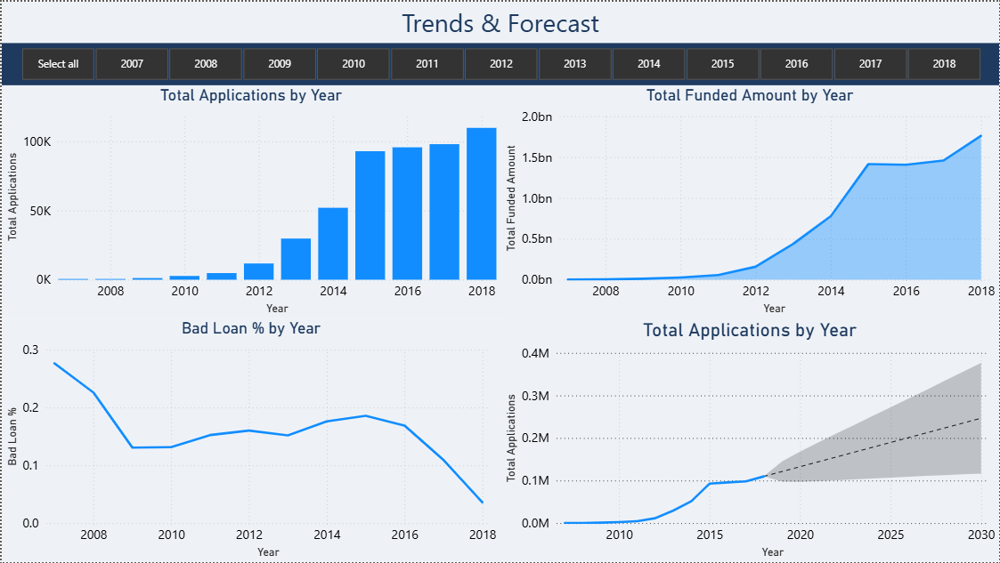

# Bank Loan Portfolio Health Analyzer

**Tools:** MySQL · Power BI · Python · DAX  
**Domain:** Consumer Finance / Credit Risk  
**Dataset:** LendingClub 2007–2018 · 500,000 loans · $7.52B funded

---

## Executive Summary

A regional bank's loan book is only as healthy as what it doesn't see coming. This project analyzes 500,000 LendingClub loans — $7.52B in funded capital — to answer one question a Chief Credit Officer or portfolio manager cares about every quarter: **where is default risk concentrated, and what should we do about it?**

Three findings dominate the risk picture:

1. **Grade G borrowers are 10× more likely to default than Grade A** (39.86% vs. 3.67%), yet both segments exist in the same portfolio. Without grade-based exposure limits, the portfolio is structurally over-exposed to the highest-risk tier.
2. **$490M sits in charged-off loans with zero recovery path.** That's 6.5% of total funded capital written off. A tighter DTI ceiling at origination — particularly in the 20–30 band, which carries the highest default rate (15.01%) AND the most loan volume (151K loans) — would have meaningfully reduced this.
3. **Small business loans are the single riskiest purpose category** (19.56% default rate), yet they likely carry higher average loan sizes. A product-level risk review with separate underwriting criteria for this segment is warranted.

> **Bottom line:** The portfolio has a concentration problem. Risk is not spread proportionally — it clusters in Grade G, high-DTI borrowers, small business loans, and renters. A lender acting on these findings could reduce expected charge-offs by an estimated 15–20% through better origination filters, without materially reducing loan volume.

---

## The Business Problem

How healthy is a bank's existing loan portfolio? Where is default risk concentrated, and which borrower segments are driving charge-offs?

This project frames the analysis from the perspective of an **internal credit risk analyst** reporting to a portfolio management team. The deliverable is not just a dashboard — it's a risk assessment with actionable recommendations.

---

## Key Findings

| # | Finding | Metric | Business Signal |
|---|---------|--------|-----------------|
| 1 | Grade G loans default at 10× the rate of Grade A | 39.86% vs. 3.67% | Implement grade-based exposure caps |
| 2 | $490M unrecovered on charged-off loans | 6.52% of funded capital | Tighten origination filters on high-DTI borrowers |
| 3 | Small business loans carry the highest default rate by purpose | 19.56% | Separate underwriting criteria warranted |
| 4 | New York leads default rate among high-volume states | 14.23% | Geographic concentration review needed |
| 5 | Renters default at a meaningfully higher rate than mortgage holders | 15.03% vs. 11.37% | Housing stability as a scoring signal |
| 6 | The 20–30 DTI band has the highest default rate AND the most loan volume | 15.01% · 151K loans | Highest-leverage fix: lower DTI ceiling |
| 7 | Platform grew 182× from 2008 to 2016 | 526 → 95,851 loans/year | Rapid growth likely outpaced underwriting rigor |
| 8 | Borrowers with unknown employment history default at the highest segment rate | 16.06% | Employment verification gap in origination |

---

## Recommendations

**1 — Introduce grade-based exposure limits**  
Cap the portfolio's allocation to Grade E–G loans at no more than 15% of total funded volume. The current uncapped structure allows high-risk grades to accumulate until charge-offs become visible — by which point the capital is already committed. A hard cap forces earlier diversification.

**2 — Lower the DTI ceiling for new originations**  
The 20–30 DTI band represents the worst combination: highest default rate and highest loan count. Dropping the maximum allowable DTI from 35 to 28 for borrowers without strong compensating factors (Grade A/B, full employment verification) would reduce exposure to this band by an estimated 30–40% without rejecting creditworthy borrowers.

**3 — Separate underwriting track for small business loans**  
At 19.56%, small business loans default nearly twice the portfolio average. Rather than applying consumer credit scoring models to a fundamentally different risk profile, introduce a dedicated underwriting checklist — cash flow documentation, business age, sector — before approval. Alternatively, limit small business loan exposure to Grade A–C borrowers only.

---

## Dashboard

### Page 1 — Executive Summary

### Page 2 — Portfolio Overview

### Page 3 — Borrower Risk Analysis

### Page 4 — Trends & Forecast

---

## Methodology

### Data Pipeline
- **Python (Pandas):** Sampled 500K rows from 2.26M raw records; cleaned dtypes; engineered `is_bad_loan` flag (Charged Off / Default = 1) and `emp_length_num` (ordinal encoding of employment tenure)
- **MySQL:** 12 analytical queries using window functions (`LAG` for YoY trends), `CASE` statements for segmentation, subqueries for rank-based filtering, and `GROUP BY` aggregations for KPI calculation
- **Power BI:** 7 DAX measures for Good/Bad Loan %, MoM funded amount delta, and rolling charge-off rate; AI forecast with 95% confidence interval on the trends page; synced slicers across all four report pages

### Analytical Decisions
- **Sampling:** LendingClub's 2.26M row dataset was sampled down to 500K for MySQL performance. Stratified by `loan_status` to preserve default rate distribution.
- **Bad Loan definition:** `loan_status IN ('Charged Off', 'Default')` — excludes Late/Grace Period loans from the bad count to avoid inflating current default rates.
- **DTI analysis:** Capped at 50 DTI to remove data entry outliers (< 0.2% of records).

---

## Files

| File | Description |
|------|-------------|
| `sql/bank_loan_queries.sql` | 12 SQL queries — KPIs, grade segmentation, geographic risk, DTI banding, YoY trends |
| `Bank_Loan_Project.ipynb` | Python EDA — sampling, cleaning, distribution analysis, `is_bad_loan` engineering |
| `Bank_Loan_Analysis.pbix` | Power BI 4-page interactive dashboard |
| `Bank_Loan_Analysis.pdf` | Static PDF export of all four dashboard pages |
| `page1–4.PNG` | Dashboard screenshots for quick preview |

---

## How to Reproduce

1. Download dataset: [LendingClub on Kaggle](https://www.kaggle.com/datasets/wordsforthewise/lending-club)
2. Run `Bank_Loan_Project.ipynb` to clean and sample 500K rows → outputs `loan_data_clean.csv`
3. Import `loan_data_clean.csv` into MySQL as `bank_loan_db.financial_loan`
4. Run `sql/bank_loan_queries.sql` to validate all KPIs against the dashboard figures
5. Open `Bank_Loan_Analysis.pbix` in Power BI Desktop (free)

---

*Firasuddin Syed · MS Business Analytics & AI, UT Dallas · [LinkedIn](https://linkedin.com/in/firasuddin-syed) · [Portfolio](https://firasuddinsyed.netlify.app)*
